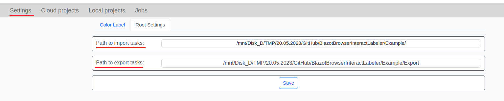
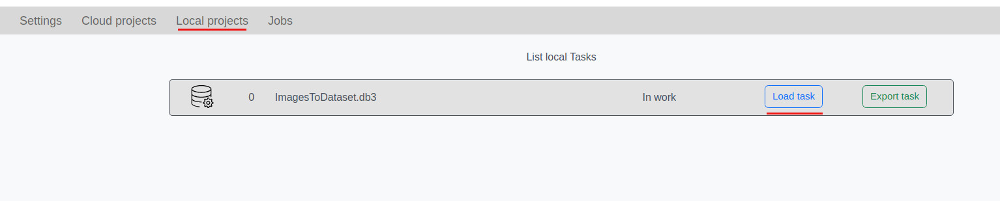
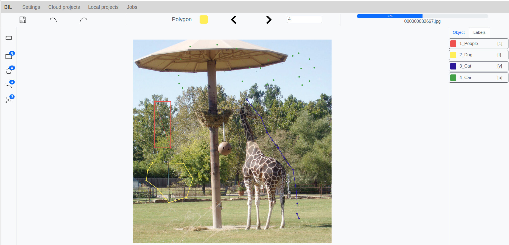

# BlazorBrowserInteractLabeler

An image markup utility. Made based on [cvat](https://github.com/opencv/cvat). One of the differences is that BrowserInteractLabeler works locally.

Concept, dataset is stored in sqlite database, sql files contain several thousand images. The markup is produced by four types of rectangle, polygon, line, point. The product runs on linux-x64/win-x64

## Install:
1. Build a utility to create a dataset  
   `dotnet publish ./BrowserInteractLabeler.DataLoader/BrowserInteractLabeler.DataLoader.csproj -c Release -r linux-x64 -o ./linux-x64/DataLoader --force`
2. Run the dataset assembly utility. 
     `./linux-x64/DataLoader/BrowserInteractLabeler.DataLoader typeWork=loadImg pathImg=./Example`
3. Build a server 
     `dotnet publish ./BrowserInteractLabeler/BrowserInteractLabeler.csproj -c Release -r linux-x64 -o ./linux-x64/webserver --force`
4. Start server 
     `./linux-x64/webserver/BrowserInteractLabeler`
5. Run chrome browser http://localhost:5000 

## How to start marking up:
1. In the settings, specify the path to the directory with datasets
   
2. In the boot menu, select the desired dataset
   
3. Marking up
   

## Hotkeys  
1. Zoom in/out image shift + mouse wheel
2. Return to original position ctrl
3. Object markup start and end [n] key
