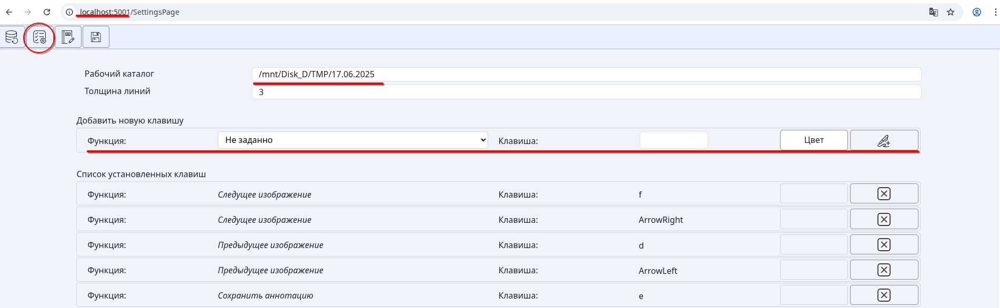
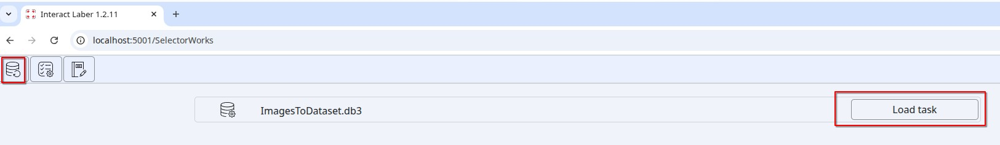
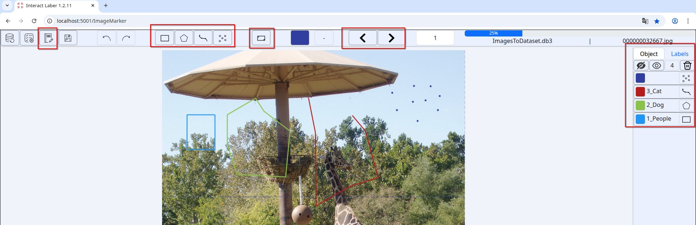

# BlazorBrowserInteractLabeler

An image markup utility. Made based on [cvat](https://github.com/opencv/cvat). One of the differences is that BlazorBrowserInteractLabeler works locally.

Concept, dataset is stored in sqlite database, sql files contain several thousand images. The markup is produced by four types of rectangle, polygon, line, point. The product runs on linux-x64/win-x64

## Install:
1. Build a utility to create a dataset  
   `dotnet publish ./BrowserInteractLabeler.DataLoader/BrowserInteractLabeler.DataLoader.csproj -c Release -r linux-x64 -o ./Deploy/DataLoader --force` 

2. Run the dataset assembly utility. 
     `./Deploy//DataLoader/BrowserInteractLabeler.DataLoader typeWork=loadImg pathImg=./Example`

3. Build a server 
     `dotnet publish ./BlazorBrowserInteractLabeler.Web/BlazorBrowserInteractLabeler.Web.csproj -c Release -r linux-x64 -o ./Deploy/linux-x64 --self-contained true` 
     `dotnet publish ./BlazorBrowserInteractLabeler.Web/BlazorBrowserInteractLabeler.Web.csproj -c Release -r win-x64 -o ./Deploy/win-x64 --self-contained true` 
     `7z a ./Deploy/linux-64.7z ./Deploy/linux-x64/` 
     `7z a ./Deploy/win-64.7z ./Deploy/win-x64/` 

4. Start server 
    `cd ./Deploy/linux-x64/`
     `./BlazorBrowserInteractLabeler.Web`
5. Run Chrome browser http://localhost:5001 

## How to start marking up:
1. In the settings, specify the path to the directory with data sets, assign hot keys.
   
2. In the boot menu, select the desired dataset
   
3. Marking up
   

## Hotkeys  
 Zoom in/out image alt + mouse wheel  
 Full listing functionality in the settings menu  

## Convert format   
Convert from BlazorBrowserInteractLabeler in yolo,  An example of conversion is located `pythonConverter/convert_BIL_to_yolo.py`

## Black Theme in Chome  
`chrome://flags/#enable-force-dark` 
`Force Dark Mode for Web Contents = Enabled` 